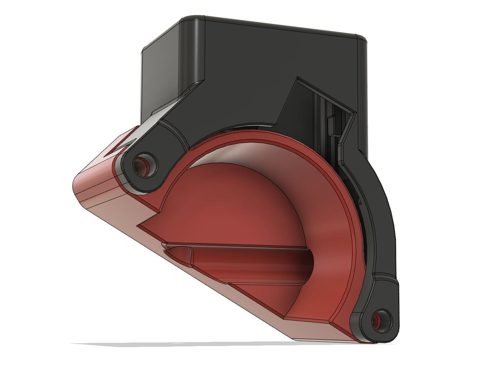
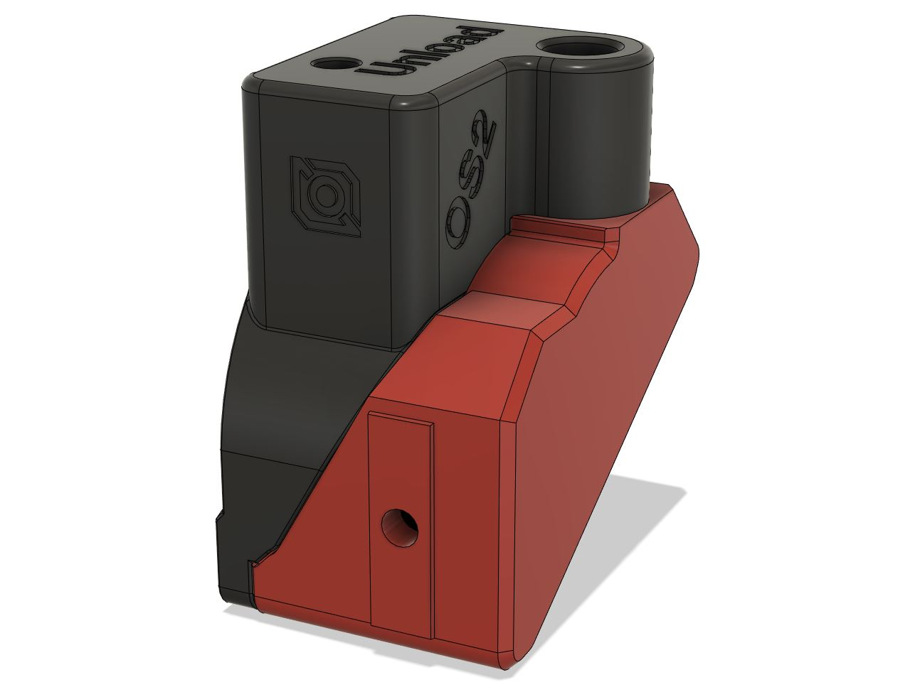

# Orbiter Filament Sensor 2020 Mount

Use this on a printer using 2020 extrusions if you use the [Orbiter extruder](https://www.orbiterprojects.com/orbiter-v2-0/) and, like me, don't/can't have the filament sensor mounted on the extruder.

## Print settings

My settings:

* 0.4 nozzle (100% line width, so 0.4)
* 0.2 layer height
* 4 top/bottom layers
* 3 walls
* 20% gyroid infill
* filament: any normal structural material will do

Adjust your settings if needed based on your preferred print setup.

## BOM

* 2 x M3 6mm-20mm SHCS or BHCS (any length in range will work)
* 1 x M3 8mm
* 1 x M3 'hammerhead' or T-nut
* 4mm OD bowden tube

## Assembly

Sensor housing bolts thread into the mount, so don't bolt/unbolt them too many times. Best to test your sensor before you mount it.